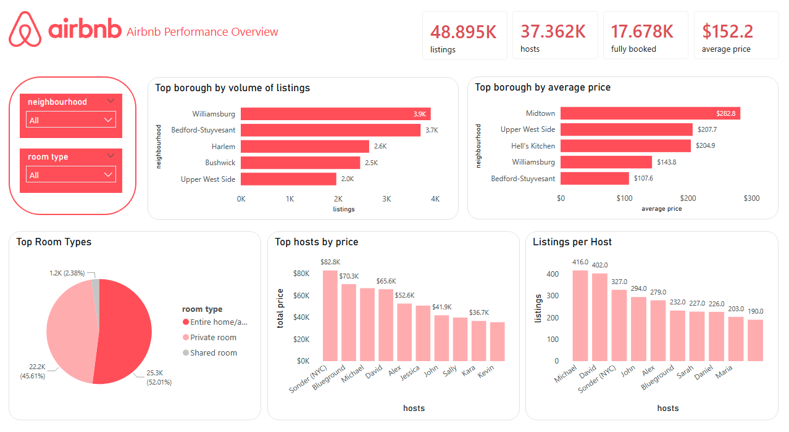
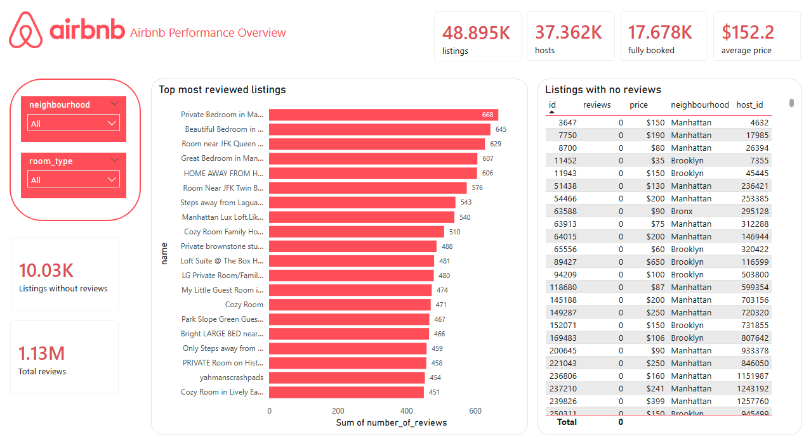
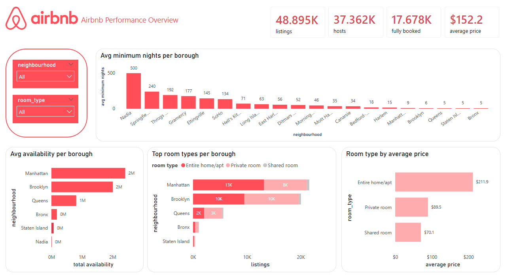

# NYC Airbnb Dashboard

A Power BI dashboard analysing the NYC Airbnb market through listing volume, pricing, availability, room types, and review activity.

## Project overview

This project explores the **NYC Airbnb 2019 dataset** in Power BI with the goal of understanding how the short-term rental market is distributed across New York City.

The dashboard focuses on key questions such as:

- How many Airbnb listings and hosts are active in NYC?
- Which boroughs have the highest volume of listings?
- How do prices vary across boroughs and room types?
- What does availability look like across the city?
- Which listings attract the most reviews?

## Objectives

The main objective of this dashboard was to turn raw Airbnb listing data into a clear and interactive report that highlights:

- market size and structure
- price patterns
- room type distribution
- review activity
- availability trends

## Dashboard pages

### 1. Market overview
This page provides a general overview of the NYC Airbnb market, including:

- total listings
- total hosts
- listings with zero availability
- average price
- top boroughs by number of listings
- top boroughs by average price
- room type distribution
- hosts with the highest number of listings

### 2. Reviews and activity
This page focuses on listing engagement and review behaviour, including:

- most reviewed listings
- total reviews
- listings without reviews

### 3. Availability and stay conditions
This page looks at booking conditions and listing availability, including:

- average minimum nights by neighbourhood
- total availability by borough
- room type distribution by borough
- average price by room type

## Tools used

- **Power BI** for data modelling and dashboard development
- **Power Query** for data cleaning and preparation
- **DAX** for calculated measures and KPIs

## Data preparation

Before building the dashboard, the dataset was cleaned and prepared by:

- checking for missing values
- formatting numeric fields correctly
- creating summary KPIs and calculated measures
- organising fields for clearer visual analysis

## 🔍 Key insights

Some of the main patterns visible in the dashboard include:

- **Manhattan and Brooklyn dominate the market** in terms of listing volume
- **Entire homes/apartments** represent the largest share of listings
- **Average prices vary significantly by location**, with some neighbourhoods standing out as much more expensive
- A substantial number of listings have **no reviews** or **zero availability**, which adds another layer to the interpretation of listing activity

## Dataset

Source: Kaggle

This dataset contains information on nearly 49,000 Airbnb listings in New York City, including:

- host information
- neighbourhood and borough
- room type
- price
- minimum nights
- number of reviews
- reviews per month
- availability across the year

## Skills demonstrated

This project highlights skills in:

- dashboard design
- KPI selection
- exploratory data analysis
- data storytelling
- Power BI visualisation
- layout and visual consistency

## 📷 Preview

### Page 1

### Page 2

### Page 3

